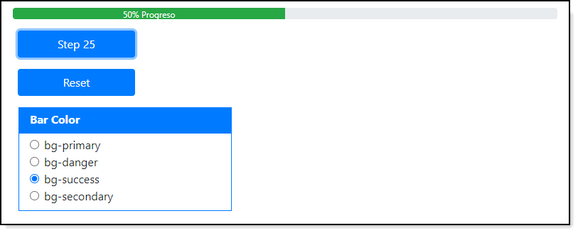

# About

Various code sample

# OED Progress bar
A flexible way to display a progress bar

## Provides
An easy way to setup and use a progress bar for English or Spanish, if other languages are needed this would require minor changes. When 100% is reached in English "done" is appended to 100 while Spanish appends "hecho"

### Requires
- Bootstrap 4
- OedProgressHelper.js (under Scripts/local)
- oedProgressbar.css (under Content/Local)
- Scripts/Local/SpokenLanguage.js which is a container for language e.g. EN, E, S, SP

In a .cfm or .html place the following in

```html
<div class="container-fluid mt-n3 pl-0 pr-0">
    <div class="progress m-3 pl-lg-1" style="height:16px;" id="progressStatus">                
        <div class="progress-bar bg-success" id="pageProgress" role="progressbar">0%</div>
    </div>
</div>
```

Initialize, if the first parameter is null English is used.
```html
<script>
	$(document).ready(function() {               
		$OedProgressHelper.init("S","#pageProgress");
	});
</script>
```

### Methods

**Note** each method with **Back** will be changed to **Bar** and **color** changed to **Color**

- setBarcolor sets bar color accepts a valid [Bootstrap color](https://getbootstrap.com/docs/4.0/utilities/colors/#background-color). Internally former color rule is first removed.
- setBarcolorPrimary sets bar color to bg-primary.
- setBarcolorDanger sets bar color to bg-danger.
- setBarcolorOedGreen sets bar color to bg-success.
- InitializeValueToZero, sets progress value to 0
- Increment sets the progress bar value to a int value
- StepByQuarters steps value by 25% to max of 100
- StepBy10 steps value by 10% to max of 100
- StepBy5 steps value by 5% to max of 100
- CurrentValue returns the current progress bar value
- Show displays the progress bar
- Hide hides the progress bar
- setLanguage to change spoken language (_must first use **int** method_)


**Shown in Spanish**


# Bootbox

- Basic code samples for [Bootbox JS](http://bootboxjs.com/).
- Bootstrap icons

## Simple alert


# BootBox samples


# Bootstrap Icons

Get icons here <https://icons.getbootstrap.com/>


